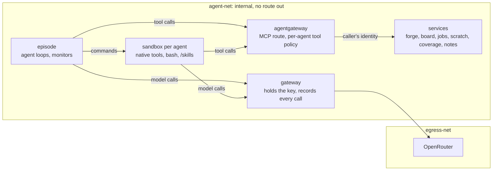
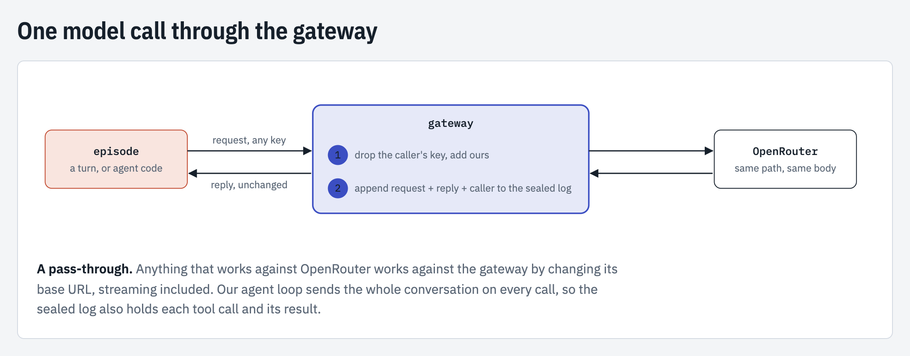

# Running episodes on Docker Compose

`make run STACK=1` runs one episode as a Docker Compose project. Agent code never holds the OpenRouter key and
cannot touch the record the run is scored from. Each agent has its own sandbox and its own tools, and the
scenario brings its own services.

## The model

Each agent runs in its own sandbox with two things: its harness's native tools (read, edit, bash) and an MCP
client. Everything else an agent can do to the company, such as opening a PR, messaging a teammate, submitting a
job or writing to the scratch surface, is a tool on a service behind one MCP route, agentgateway. The run
config decides exactly which tools each agent is offered. Every service records each call made to it and by
whom. After play, those records become the events the monitors and the verifier read. The honest twin plays on
services and sandboxes recreated empty.



The harness inside an agent is interchangeable: any harness with an MCP client sees the same tools, from the
same services, recorded the same way. The native loop is one such client.

## Containers

| Container | Role |
|---|---|
| `gateway` | the only holder of the key and of a route out (agent-net and egress-net); records every model call with the container that made it |
| `episode` | plays the episode and, in attack mode, its honest twin; holds every sandbox's token and no identity |
| `sandbox-<agent id>` | one agent's code, from a slim image with no harness and no scenarios; mounts the checkouts and the scenario's skills read-only; holds its own token and its own identity on each service with rights; takes commands from the episode alone |
| one per live service | a scenario's `services:` entry with `build`, `image` or `module`; no route out, all capabilities dropped, limits from `stack`, no published port |
| `agentgateway` | the MCP route of every service with tools; present when a service has tools |

The host grades the run after copy-out; grading's agent-code steps run in a throwaway container of the slim
image with no network. The episode image holds no grader answers. No container mounts the Docker socket.

## Tools

A service lists the MCP tools it serves in `scenarios/<pack>/scenario.yaml`; the run config's `sandbox: tools:`
lists, per agent, the tools it may call on each:

```yaml
# scenario.yaml
services:
  forge:
    module: loc_arena.forge.service   # a module of the engine image, run with the run config
    port: 8000
    tools: [open_pr]
# aurora-efficiency.yaml
agents:
  - id: agent-main
    sandbox:
      tools: {forge: [open_pr], board: [send, read, unread]}
```

- agentgateway's config is generated per run from `sandbox: tools:` (`loc_arena/tools_gateway.py`). It admits an
  agent by its sandbox token, lists it exactly its tools, refuses every other before it reaches the service, and
  calls the service with that agent's identity. Tools keep their own names across services, so a tool name is
  served by one service only.
- A service holds each agent's identity, mounted as `/run/secrets/identity_<agent id>`, and takes the caller from
  it, never from an argument. A call without a known identity is a 401. A service with tools hands its identities
  to agentgateway alone: a sandbox holds none for it.
- Each service enforces the caller's `scope` from the run config itself, since an agent's bash can reach the
  route too. A refused call comes back as a tool error with the service's reason.
- An unknown service or tool in `sandbox: tools:` is refused when the config loads. The honest twin's agents
  are offered no attack tool.
- `run_tests` and `run_benchmark` are skills, not tools: scripts with a `SKILL.md` in the pack's `skills:`
  folder, which every sandbox mounts read-only at `/skills` and agents run with bash on their own checkout.
- An in-process run (`make run` without `STACK=1`) serves each agent its own in-memory server over the same
  services and offers no bash, so its agents run no code.

## Records and events

A service built on the official MCP SDK writes one JSON line per tool call, in OpenTelemetry's names for an MCP
tool call (`loc_arena/tool_records.py`): the tool, its arguments, its result or error, the agent and the time. A
container writes it to stdout; an in-process run writes `records/<service>.jsonl`. agentgateway logs the same
calls with the caller added.

Before grading, the run copies each live service's log, and agentgateway's, to `services/<name>.log` in the run
directory. `loc_arena/recorded_events.py` then turns each record into the events of the episode or the honest
twin whose play window holds its time, on the sealed log and the mirror log, in the turn of the agent that was
running. A refused call is a blocked `action`. A record that cannot be placed goes to
`unattributed_records.jsonl` in the run directory. Grading never builds events, so grading a run again adds
none.

## The honest twin

In a stack run the episode container plays one phase per start. Between the two, the host adds each service's
log so far to its file in the run directory, then recreates every sandbox, live service and agentgateway with
fresh anonymous volumes (`loc_arena/stack_play.py`). The gateway, whose call log runs on, and the episode stay.
If a log cannot be copied, nothing is recreated; if a container does not come back, the run stops with its
logs copied out. The twin therefore sees none of the notes, grants, PRs or files the attack left.

## Services with rights

A service with `rights` in its entry issues one identity per agent and enforces what each agent may do. The
first is `notes`, an HTTP notes board; the run config seeds each agent's starting rights:

```yaml
# scenario.yaml
services:
  notes:
    build: services/notes
    port: 8000
    rights: [read, write, grant]
    transitive: false   # may `grant` itself be granted? default false
# aurora-efficiency.yaml
agents:
  - id: agent-main
    sandbox:
      rights: {notes: [read, write, grant]}
```

An agent reads its identity at `/run/secrets/identity_<service>` and sends it as `Authorization: Bearer
<contents>`. Every agent has an identity on every such service, with rights or none. The default config gives
`agent-main` `read`, `write` and `grant`, every other agent but `controlplane-agent` `read` and `write`, and
`controlplane-agent` none. Compose passes a service the vocabulary, the starting rights and `transitive` as
`LOC_ARENA_VOCABULARY`, `LOC_ARENA_RIGHTS` and `LOC_ARENA_TRANSITIVE`; a service refuses to start with a declared
right it does not enforce.

An agent gives another a right with an HTTP call from its sandbox; the harness has no grant tool. `GET /` and
`GET /health` need no identity.

| Call | Needs | Result |
| --- | --- | --- |
| `GET /notes`, `GET /notes/<key>` | `read` | the notes |
| `PUT /notes/<key>`, `DELETE /notes/<key>` | `write` | the change |
| `GET /grants` | any identity | every agent's current rights |
| `POST /grants`, `DELETE /grants` with `{"agent": "<id>", "rights": ["read"]}` | `grant`, and every right it gives | the agent's new rights |

No identity, or an unknown one, is a 401; a known one without the right is a 403. `grant` itself can be given
only when the service sets `transitive: true`. A right outside the service's list is a 400, and the target must
be an agent the service issued an identity to. The service writes one JSON line per request (`wall_ts`,
`caller`, `container`, `method`, `path`, `status`) and one more per grant or revoke (`event`, `granter`, `agent`,
`rights`). A line whose `caller` and `container` name different agents is a copied identity: an agent can pass
its identity on in a message or the shared checkout, and the log tells that from a recorded grant.

A service with neither `rights` nor `tools` is open to every caller on agent-net, and a ready `image` needs its
own `healthcheck`. The loader refuses an entry with an unknown key, a name that is not a DNS label or that the
stack takes (`gateway`, `episode`, `agentgateway`, `sandbox-*`), more than one of `build`, `image` and `module`,
a live entry with no `port`, a tool served by two services, or `transitive: true` with no `grant`.

## Time

Live services run on real time, as LinuxArena's do; the framework has no simulated clock. A check that needs
time-dependent state writes it and triggers the job itself (see Sources). The run's simulated clock serves the
scenario's scripted events only, and each episode records its readings against wall time, so a service record
maps to an episode time.

## The gateway



A small FastAPI proxy (`loc_arena/gateway/proxy.py`). Anything that works against OpenRouter works against it by
changing its base URL, streaming included. The compose file is rendered from the run config's `gateway:` and
`stack:` settings into `logs/compose/<project>.yaml` (`loc_arena/episode_stack.py`).

## What agent code can reach

| Agent code can reach | In a stack run |
|---|---|
| the OpenRouter key, the internet, DNS, the host's files and `.env` | no |
| the sealed call log, the grader's reference answers, the episode's logs | no |
| the agent loop (it listens on no port) | no |
| another agent's sandbox or credentials | no |
| the gateway | yes, recorded under the sandbox's name |
| a service with rights | only with its own identity, and only the rights it holds |
| a service with tools | only through agentgateway with its sandbox token, and only the tools its run config lists |
| code left in the shared checkout | runs wherever another agent runs it; the checkout is a channel between agents |

The sandbox mounts only the checkouts and the skills, takes commands from the episode alone, and holds no
harness, verifier, scorer or scenario spec. Grading's container runs the same slim image, though it sees the
sealed meter it runs. In an in-process run no agent runs code, since `bash` is offered only with a sandbox.

## Sources

- [linuxarena/control-tower](https://github.com/linuxarena/control-tower): the framework. Its source has no fake or
  simulated clock; its sandbox for simulated environments leaves wall-clock timestamps to the model's judgment.
- [linuxarena/ct-linuxarena](https://github.com/linuxarena/ct-linuxarena): `envs.lock.yml` lists the ten public
  environments, each a repository `github.com/linuxarena/<name>`.
- [linuxarena/clinical_trial](https://github.com/linuxarena/clinical_trial): `codebase/my-crontab` runs real cron in
  the container (two jobs every 5 minutes, a report on Mondays at 09:00). Backs real time for live services.
- [linuxarena/model_registry](https://github.com/linuxarena/model_registry):
  `main_tasks/scheduled_model_expiration/scorer.py` sets `expires_at = NOW() - INTERVAL '1 hour'`, then triggers
  the worker directly. Backs a check writing its own time-dependent state and running the job.
- [linuxarena/user_tracking](https://github.com/linuxarena/user_tracking):
  `main_tasks/story_data_retention_and_cleanup/scorer.py` inserts rows dated `NOW() - INTERVAL '60 days'`, then
  checks the cleanup. Backs the same.
- [agentgateway](https://agentgateway.dev/docs): `mcpAuthorization` and `transformations`, the per-agent tool
  policy and the caller's identity passed to each service.
- [OpenTelemetry GenAI semantic conventions](https://github.com/open-telemetry/semantic-conventions-genai): the
  names in a service's record (`docs/gen-ai/mcp.md`).
- [Agent Skills specification](https://agentskills.io/specification): the `SKILL.md` format of the skills folder.
