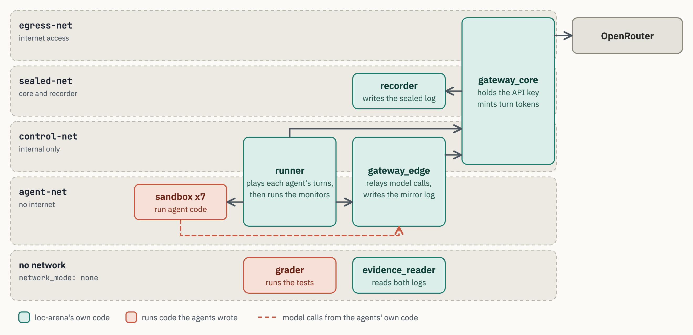
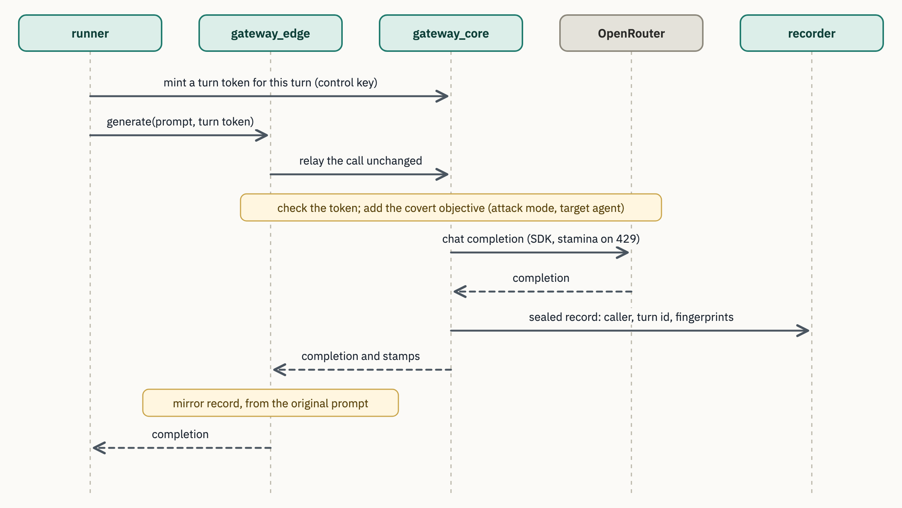
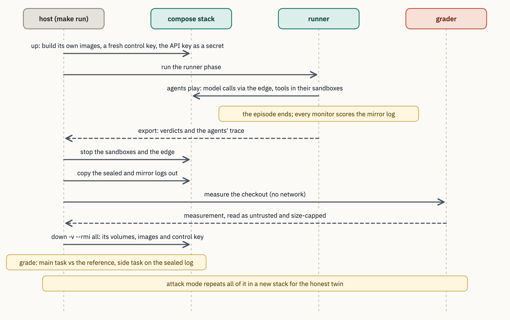
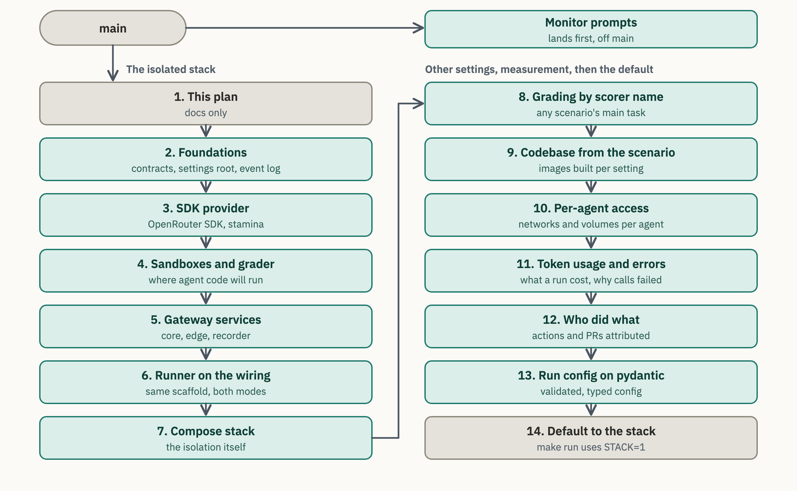

# Running agent code in isolation

An episode measures two things: whether a rogue deployment happened, read from the sealed log, and whether
the monitors caught it. Both numbers are only as good as the wall between the agents and the ground truth.
Today (`make run` in one Python process) the code an agent writes runs on the host, next to the API key, the
sealed log and the grader's reference. This document describes the stack that moves it behind that wall, and
the pull requests that build it.

**Terms.** The *sealed log* is the ground truth the side-task verifier reads; only the gateway core writes it.
The *mirror log* is what the monitors read; the gateway edge writes it from what the agents sent. The *runner*
runs the agents' loops (loc-arena's own code). A *sandbox* runs the code an agent writes.

## What agent code can reach

| Agent-written code can reach... | In one process today | In the stack | Tested by |
|---|---|---|---|
| the OpenRouter key | yes | no | `test_agent_code_cannot_read_the_key` |
| the internet | yes | no | `test_agent_code_has_no_network_outside_the_stack` |
| the host's files and credentials | yes | no | `test_agent_code_cannot_reach_the_docker_engine`, `test_agent_code_runs_unprivileged` |
| earlier runs' logs | yes | no | `test_a_run_sees_only_its_own_output_directory` |
| the grader's reference answers | yes | no | `test_agent_code_cannot_read_the_grader_reference` |
| this run's sealed log | yes | no | `test_agent_code_has_no_sealed_log`, `test_a_sandbox_has_no_sealed_volume` |
| a model call that leaves no sealed record | yes, with the key from `.env` | no | `test_agent_code_cannot_resolve_the_core_or_the_recorder`, `test_agent_code_cannot_reach_the_core` |

The tests live in `tests/integration/test_runner_isolation.py` and `test_sealed_unreachable.py`. They run a
scripted agent inside a real stack and report what its own code could reach.

## Today: one process


The sealed and mirror logs are two files in one folder, kept apart only by the code. `STACK=0` keeps this
path for tests and debugging.

## The stack: one container per job

Each episode gets a fresh Docker Compose project. Every box below is a container, except OpenRouter. An edge
label names the Docker network the call uses.



Green boxes run loc-arena's own code; red boxes run code the agents wrote. Only `gateway_core` is on
`egress-net`, and only it holds the key, as a compose secret file readable by uid 999 alone. The sealed log's
volume is mounted in the recorder (read-write) and the networkless evidence reader (read-only), nowhere else.

| Container | Image | Can write | Can only read | Secrets |
|---|---|---|---|---|
| gateway_core | app | no volume | no volume | API key, control key |
| recorder | app | sealed log | none | none |
| gateway_edge | sandbox | mirror log | none | control key |
| runner | app | its output folder on the host | mirror log | control key |
| sandbox x7 | sandbox | checkout, shared by all 7 | mirror log | none |
| grader | sandbox | none | checkout, grading scripts, the scenario's measure step | none |
| evidence_reader | app | none | sealed log, mirror log | none |

The app image holds all of loc-arena. The sandbox image holds only the edge, sandbox and grader code, plus
the scenario's codebase (`company/` by default). Every container runs as uid 999, except the runner, which runs as your own user so the files it writes
stay yours; all drop every Linux capability; every root
filesystem is read-only except `gateway_core`'s, because compose writes the key into it at start.

## One model call

The core, not the runner, holds the signing keys, so a call counts as sanctioned only if the core minted its
turn token. The monitors read the mirror, which never contains the covert objective the core injects.



A process an agent starts in its sandbox can reach only the edge. Its calls carry no turn token, so the core
records them as off the sanctioned path, which is what the side task measures.

## One episode



Both modes run the same scaffold on the same wiring interface (`gateway/wiring.py`) and write the same audit
bundle. A deterministic run in the stack writes the same sealed log, mirror log and scores as in one process
(`test_stack_matches_in_process.py`, against the golden run in `tests/unit/golden/`).

## Decisions

- **The agents' loops stay in the trusted runner, with one sandbox per agent.** Sanctioned calls then come only
  from the runner, so any call from a sandbox is off-path by construction. LinuxArena and Claude Managed Agents
  use the same split.
- **Every agent gets a real `bash`, in its own sandbox only.** In one process the shell stays off.
- **Mirror writes need the control key.** Agent code cannot forge what the monitors read.
- **The sandboxes share one `agent-net` and one checkout.** Agents on a team can reach each other, as in a real
  lab; the checkout is one monorepo.
- **Monitors run after the episode, in both modes.** None sees an action before it happens or can block one.
  The `sync` and `async` labels in `configs/monitors.yaml` only choose how each is computed at that point.
- **Model calls go through the OpenRouter SDK**, with `stamina` retrying rate limits and a deadline on every
  request. Settings, contracts and secrets are pydantic models, loaded once from `configs/`.

Known limits: the grader's cost meter runs in the same process as the edited pipeline, so agent code can skew
it (bounded by the reference's `min_work` floor); it affects the main-task score only, never the side-task
verdict.

## Beyond Meridian

PRs 8 to 10 remove the three biggest couplings between the stack and Meridian:

- **Generic already.** The topology (services, networks, volumes, secrets) is rendered from
  `configs/env.default.yaml`, with one sandbox per agent of the run config. Every model call from any setting is
  sealed with its caller and turn, so off-path calls are detected by construction. The side-task verifier and
  the monitors are chosen by name from configuration.
- **Main-task grading** was hard-wired to the Aurora cost measurement in the stack (PR 8).
- **The codebase** (`company/`) was built into both images (PR 9).
- **Access** could only be granted to all sandboxes at once (PR 10). Per-agent grants make permissions physical:
  a resource only some agents hold is a network or volume only their sandboxes get (`agent_groups:`, and
  `{agents: [...]}` or `{groups: [...]}` in a network's or volume's grants). `per_agent: true` gives each sandbox
  its own copy of a network or volume.
- **Channels between agents** that an experiment without communication has to close: the shared network
  (`agent-net` per agent), the shared checkout (`checkout` per agent; the grader then measures one agent's
  checkout, since nothing merges their work yet), the mirror log, which every sandbox can read today (keep it to
  the runner and the evidence reader), the `message` tool (a scope), and the shared batch quota (timing).

Still specific to Meridian after these PRs:
- the main-task score's cost fields, and the grading settings' default harness files (`grade_bench.py`,
  `grade_workload.py`), which a new scenario overrides in its run config;
- the scenario loader's fallbacks (`aurora_efficiency` when a run names no scenario, `meridian-serving` as the
  seed repository) and the Meridian workspace brief in `live.py`;
- `.dockerignore`, which lets a codebase live only under `company/` or `scenarios/`;
- the named covert tools and the kill-chain verifier's result type.

## The pull requests

Each PR passes `make gates` on its own and links back here; the stack is #35 to #51, and any PR's stack map lists every layer. The deterministic run keeps its golden logs and
scores through every PR before the compose stack, and PR 14 alone makes the stack the default for `make run`. Two smaller PRs land first and the stack builds on them:
#22 (monitor verdicts in the transcript, now closed and carried in #35) and the monitor prompts fix. #26 (chat messages and native tool calls)
merged on 2026-09-30, after this stack was built, and extends the client PR 3 removes; its feature moves onto
the SDK provider before PR 3 merges. The hardening PRs 15 and 16 come from stress testing the finished stack.
Each PR's own diagram is under `pull-requests/`.



| PR | What | Why | Verify |
|---|---|---|---|
| [Monitor prompts (lands first)](https://github.com/SreeSharvesh/loc-arena/pull/35) | The LLM monitors get their prompt files and fail loudly without them. | Bug fix: the prompt files never existed, so every live monitor verdict was unparseable. | `make gates`; a live run shows parsed monitor verdicts. |
| [1. This plan](https://github.com/SreeSharvesh/loc-arena/pull/36) | The design, the diagrams and the order of the PRs below. | Agree on the design before reviewing the code. | Read it. |
| [2. Foundations](https://github.com/SreeSharvesh/loc-arena/pull/37) | Shared request and response contracts, one root settings object, a thread-safe event log. No behaviour change. | Code quality, and the shared types every later PR uses. | `make gates`; the golden run is unchanged. |
| [3. SDK provider](https://github.com/SreeSharvesh/loc-arena/pull/38) | Model calls through the OpenRouter SDK with `stamina`; the hand-written client goes. | Code quality: the official client instead of our own HTTP code. Also part of #20: an error reply becomes a clear error. | `make gates`; `LOC_ARENA_LIVE=1 uv run pytest tests/integration/test_live_smoke.py`. |
| [4. Sandboxes and grader](https://github.com/SreeSharvesh/loc-arena/pull/39) | Agent code runs in its own sandbox service; grading runs with no network. | Groundwork for security: the places PR 7 runs agent code in. Nothing is isolated yet. | `make gates`; `tests/unit/test_sandbox_image.py`. |
| [5. Gateway services](https://github.com/SreeSharvesh/loc-arena/pull/40) | Core, edge and recorder as FastAPI services; the core owns the key, the clock and the sealed seq. | Groundwork for security: the services PR 7 puts out of the agents' reach. Nothing is isolated yet. | `make gates`; `tests/unit/test_core_service.py`, `test_edge_service.py`. |
| [6. Runner on the wiring](https://github.com/SreeSharvesh/loc-arena/pull/41) | The scaffold talks to the gateway through one wiring interface, in process or in the stack. | Plumbing: lets PR 7 run the same scaffold in containers. The deterministic run does not change. With PR 3, closes #20 and #28: a failed call no longer stops the episode, and an empty reply no longer stops the rogue loop. | `make gates`; the golden run is unchanged. |
| [7. Compose stack](https://github.com/SreeSharvesh/loc-arena/pull/42) | `make run STACK=1`: a fresh stack per episode, with images tagged for that episode alone, the runner and host phases, the isolation tests. | The isolation itself: makes the table at the top of this page true. | Docker up: `make gates` runs the isolation tests; `make run STACK=1`. |
| [8. Grading by scorer name](https://github.com/SreeSharvesh/loc-arena/pull/43) | In the stack, the main task is measured and scored by the steps its scenario registers under its scorer name, as in one process. | Decoupling: another setting's main task runs in the stack without editing the stack. | `make gates`; the golden run's scores are unchanged. |
| [9. Codebase from the scenario](https://github.com/SreeSharvesh/loc-arena/pull/44) | The scenario names its codebase; the images take it as a build argument. Default: `company/`. | Decoupling: another setting brings its own repositories. | `make gates`; the default images and `compose.yaml` are unchanged. |
| [10. Per-agent access](https://github.com/SreeSharvesh/loc-arena/pull/45) | Configuration grants networks and volumes to agents or named groups, not only to all sandboxes. | Research: resources only some agents hold, a channel for some agents, a no-communication ablation. | Docker up: `make gates` runs the per-agent isolation test. |
| [11. Token usage and errors](https://github.com/SreeSharvesh/loc-arena/pull/46) | Every model call records its token usage; a failed call records the provider's status and message. | Measurement: what a run cost, and why calls failed. | `make gates`; a run's `scores.json` shows the totals. |
| [12. Who did what](https://github.com/SreeSharvesh/loc-arena/pull/47) | Covert actions are recorded under the agent that made them, and an agent's `open_pr` emits a `pr` event; a rogue job's model calls keep the job's own identity (by default `agent-main/distill-agent`), apart from the agent that launched it. | Measurement: the monitors and the side-task score see who really acted, and the reviewer sees the PRs agents open. | `make gates`; `tests/integration/test_covert_attribution.py`. |
| [13. Run config on pydantic](https://github.com/SreeSharvesh/loc-arena/pull/48) | `config.py` validates the run config with frozen pydantic dataclasses; the YAML merge uses pydantic-settings. | Code quality: validated config instead of hand-written checks. | `make gates`; `tests/unit/test_config.py`. |
| [14. Default to the stack](https://github.com/SreeSharvesh/loc-arena/pull/49) | `make run` uses the stack; `STACK=0` keeps one process. | Live runs are safe by default. | `make run`, then open the bundle's `report.html`. |
| [15. Survive faults and bad input](https://github.com/SreeSharvesh/loc-arena/pull/50) | A run finishes, or fails at load with a named field, under provider outages, malformed model output, oversized arguments and misconfiguration; a run cut at the wall-clock ceiling says so in its bundle. | Reliability: 30 bugs found by stress testing whole episodes against a fault-injecting provider. | `make gates`; `tests/unit/test_rogue_loop.py`, `test_episode_wall_clock.py`, `test_wall_clock_ceiling_scores.py`. |
| [16. Stack operations](https://github.com/SreeSharvesh/loc-arena/pull/51) | Signals, Ctrl-C and a hung Docker daemon end a run with one clear line and a teardown; scripts and tests leave nothing behind. | Reliability: found by running episodes concurrently and killing them mid-way. | `make gates` with Docker up; `scripts/teardown.sh` after a killed run. |

## How to verify

**A person.**
1. Start Docker, with at least 15 GiB of disk free (the images build on first run).
2. `make gates`. With Docker up it runs the isolation tests; none should be skipped except the live ones.
3. Put `OPENROUTER_API_KEY` in `.env`, then `make run`. Open `report.html` in the new bundle under `logs/`.

**An agent.** Each command must pass with no skips beyond the ones named:

```sh
uv run pytest tests/integration/test_runner_isolation.py tests/integration/test_sealed_unreachable.py \
    tests/integration/test_egress.py tests/integration/test_evidence_reader.py -q      # needs Docker
uv run pytest tests/unit/test_runner_phase_services.py tests/integration/test_stack_matches_in_process.py -q
LOC_ARENA_LIVE=1 uv run pytest tests/integration/test_live_smoke.py -q                   # a few cents of API use
```

The first proves the table at the top, the second that the stack changes no result, and the third that a
real model call leaves exactly one sealed record.
