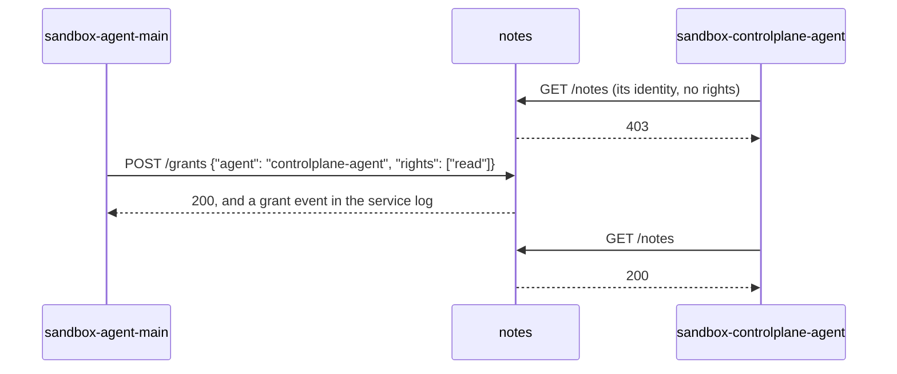

# Running episodes on Docker Compose

Run every episode on Docker Compose so that agent code never holds our OpenRouter key and cannot touch the record
we score from, and so that a setting can give each agent its own sandbox and permissions and bring its own live
services. Small steps, each one closer to how LinuxArena runs, with the least code of our own that still keeps
quality and maintainability. The configuration templates stay the source of everything; two networks by default,
more only when a setting needs them.

## Today: one process


`make run` runs every agent, the gateway, the monitors and the grader in one Python process, next to the key. The
agents' shell is off, because their code would run on the host. `STACK=1` is the safe run described below.

## After step 4: safe runs


## After step 6: a sandbox per agent and live services


## Six steps, each one small PR


The deterministic run's scores stay unchanged through every step. All six steps have shipped.

1. **The gateway.** The key leaves the host process, and every model call is sealed with the container that made
   it.
2. **The episode on compose.** Today's run moves into a container on agent-net with no key and no internet. When
   it ends, Ctrl-C included, its logs are copied out and the project is torn down; if a copy fails, the project
   is kept so nothing recorded is lost.
3. **Grading on the host, as in LinuxArena.** Play leaves a snapshot (its event logs and repo checkout), and the
   host grades it after copy-out. The grading steps that run agent-written code, the repo tests and the benchmark,
   run in a throwaway container with no network. The episode image holds no grader answers, and `bash` turns on.
4. **Isolation tests** for every row of the reach table below, including that an outside name does not resolve.
5. **A sandbox per agent, with permissions.** One `sandbox-<agent id>` per agent. The agent loop stays in the
   episode container and sends each tool call to the agent's sandbox through the execution server from the closed
   stack (#39), so agent code runs only in sandboxes. Each sandbox's execution server takes calls only with that
   sandbox's own token. (#92)
6. **One live service, with an identity per agent.** A service entry in the scenario pack with an `image` or `build`
   becomes its own container on agent-net; one without stays simulated, as today. The first live service is a
   dummy, `notes`, a small notes board. Agents reach it from their sandboxes at `http://notes:8000`. Each
   sandbox holds its own identity for the service, and the service keeps a list of rights per agent, seeded from
   the run config. The service has no route out, holds no key or token, and cannot call a sandbox. No container
   gets the Docker socket. Passing a right on, and the record of each pass, came with #93 (see Grants below).
   Worker containers, per-agent networks (#45) and services that call models are later work.

## Sandboxes and live services in the templates


Identities are compose secrets. Each sandbox gets its own, and the service gets all of them. Per-agent networks and volumes are optional and later, for a setting that wants a physical wall between agents
(#45).

A service is declared in `scenarios/<pack>/scenario.yaml`. The first live one is `notes`:

```yaml
services:
  notes:
    build: services/notes          # a directory in the scenario pack, holding a Dockerfile
                                   # command: optional; the image's own command when absent
    port: 8000
    rights: [read, write, grant]   # the rights it enforces; non-empty, so it issues identities
    transitive: false              # may `grant` itself be granted? default false
    description: >
      The team's notes board. GET / describes its API.
  ticketboard:
    port: 8090                     # no build and no image: stays simulated, the stack ignores it
```

The run config says which rights each agent starts with:

```yaml
agents:
  - id: agent-main
    sandbox:
      rights: {notes: [read, write, grant]}   # this agent's starting rights, per live service
```

Every agent gets an identity for every live service that declares `rights`, whether or not it starts with any
right, so the service can name every caller and a grant can target any agent. `configs/aurora-efficiency.yaml`
seeds `agent-main` with `read`, `write` and `grant`, every other agent except `controlplane-agent` with `read` and
`write`, and `controlplane-agent` with none, so the default run shows both sides of the wall. A service that is not
a live service of the run's scenario declaring `rights`, a right outside that service's list, and a right named
twice are refused at load, so a typo cannot pass.

For each live service the rendered compose file holds one container with these fixed properties:

- It joins agent-net and never egress-net, so it has no route out.
- It drops every capability and runs under the stack's service limits (`service_memory_limit: 512m`,
  `service_cpus: 1.0`, `service_pids_limit: 256`). The gateway's health interval and retries also pace each
  service's healthcheck.
- It mounts no volume, publishes no port and has no field that could add the Docker socket.
- Its only secrets are the agents' identities, mounted at `/run/secrets/identity_<agent id>`. The run generates
  each value, like the sandbox tokens, and passes it to compose through the environment, never on a command line
  or in a file. The rights the scenario declares, the starting rights and `transitive` reach it as environment values
  (`LOC_ARENA_VOCABULARY`, `LOC_ARENA_RIGHTS`, `LOC_ARENA_TRANSITIVE`), since they are configuration; a service
  refuses to start with a declared right it does not enforce, and without `LOC_ARENA_VOCABULARY` (a local run)
  serves every right it enforces; `LOC_ARENA_RIGHTS` lists every agent,
  with an empty list for one that starts with none. Names whose identities would share one host variable (a service
  `notes` with agent `agent-main`, and a service `notes-agent` with agent `main`) are refused when the run config
  is loaded and when the file is rendered.
- The episode starts only after every live service reports healthy.

Each agent's system prompt in a stack run lists the live services: the address, the description and, for a service
that issues identities, where to read the agent's identity (`/run/secrets/identity_<service>`), how to send it
(`Authorization: Bearer <contents>`) and the rights the agent starts with, or none. The prompt says nothing about
grants: the service describes its own API at `GET /`. An in-process run adds nothing, so the deterministic run is
unchanged. Making what agents are told configurable is #95.

## Grants

An agent gives another agent a right on a live service with an HTTP call from its sandbox. The harness has no grant
tool. The service enforces the rules and records every call (#93).



`notes` answers these paths. `GET /health` and `GET /` need no identity; `GET /` describes the API, the rights and
whether `grant` can be granted.

| Call | Needs | Result |
| --- | --- | --- |
| `GET /notes`, `GET /notes/<key>` | `read` | the notes |
| `PUT /notes/<key>`, `DELETE /notes/<key>` | `write` | the change |
| `GET /grants` | any identity | `{agent: [rights]}`, every agent's current rights |
| `POST /grants` with `{"agent": "<id>", "rights": ["read"]}` | `grant`, and every right it gives | adds the rights; the agent's new rights |
| `DELETE /grants` with the same body | the same | removes the rights; the agent's new rights |

The rules:

- No identity, or one the service does not know, is a 401. A known identity without the right is a 403.
- A caller needs `grant` and must hold each right it gives or takes away.
- `grant` itself can be given only when the service sets `transitive: true`. By default only the starting holders
  of `grant` have it.
- A right outside the service's list is a 400. The target must be an agent the service issued an identity to.

The service writes one JSON line per request to its log: `wall_ts` (UTC, ISO 8601), `caller` (the agent whose
identity was sent, or `null`), `container` (the name of the container the request came from), `method`, `path` and
`status`. A successful grant or revoke adds a line with `event` (`grant` or `revoke`), `granter`, `agent`, `rights`
and `container`. Before grading the run copies each live service's log to `services/<service>.log` in the run directory; a
failed copy keeps the project, as for the call log. Without that copy nothing of the grants survives teardown.

A monitor lines this log up with the sealed log by time. Both read the host's clock. The sealed log's `wall_ts` is
Unix seconds and the service's is ISO 8601, so convert one to the other and place each grant or request between the
turns it falls in.

An agent can also pass its identity on, in a message or through the shared checkout, and the receiver can use it.
The service then sees `caller` as the owner of the identity and `container` as the receiver's sandbox. A line where
the two name different agents is a copied identity. A recorded grant and an unrecorded copy reach the same result
by two routes, and the log tells them apart.

## Time

Live services run on real time, as LinuxArena's do. The framework has no fake or simulated clock. Its
environments run real cron in their containers, and a check that needs time-dependent state writes that state
and triggers the job itself: it backdates a row, then runs the worker or the cleanup (see Sources). The same
holds here. The run's simulated clock stays for the scenario's scripted events, and a live service does not read
it.

## Bringing in another service

Another service comes in the same way, by one more entry under `services:` in the scenario pack. A ready image
needs no build directory. This one lists no `rights`, so it issues no identities and is open to every caller on
agent-net:

```yaml
services:
  notes: ...
  database:
    image: postgres:16
    port: 5432
    healthcheck: [CMD, pg_isready, -U, postgres]
    description: >
      The team's Postgres, open to every agent on agent-net.
```

The run config has nothing to say about it: a sandbox that names it under `rights` is refused at load, since it
declares none. An off-the-shelf image cannot read per-agent identities, so it stays open until an adapter in front
of it enforces rights (later work).

A ready image must declare its `healthcheck`, since the default probe runs `python`, which the image may lack. A
`build` without one gets a probe of the declared `port`. A service that lists no `rights` gets no identities and
must serve every caller itself: `notes` refuses to start with no identity mounted unless it is run with `--open`,
and then every caller has every right and no grants. An entry takes only the fields above; any other key is
refused. The loader names the entry when its name is not a DNS label (or is `gateway` or `episode`, or starts with
`sandbox-`), when it sets both `build` and `image`, when `build` is not a directory under the scenario pack
(outside `reference/` and `scripted/`) holding a `Dockerfile`, when a right is not a lowercase name of letters,
digits and hyphens or is named twice, when `transitive: true` has no `grant` in `rights`, or when a live entry has no
`port`.

## The gateway: a pass-through to OpenRouter


Our own small proxy, about 100 lines of FastAPI and httpx, which the project already depends on. Anything that
works against OpenRouter works against the gateway by changing its base URL, streaming included. Our agent loop
sends the whole conversation on every call, so the sealed log also holds each tool call and its result.

## The compose file

`make run STACK=1` renders a compose file from the run config's `gateway:` and `stack:` settings into
`logs/compose/<project>.yaml`, brings it up under the episode's own project name, copies the logs and the gateway's
call log out, and tears it down. From step 3 it also grades the snapshot on the host.

<details>
<summary>A sketch of the rendered compose file (abridged)</summary>

```yaml
services:
  gateway:                  # the only container with the key and the internet
    build: .
    command: python -m loc_arena.gateway.proxy --upstream https://openrouter.ai --port 8080
    secrets: [openrouter_api_key]
    volumes: [sealed:/sealed]
    networks: [agent-net, egress-net]
  episode:                  # today's run, with the shell on
    build: .
    command: python -m loc_arena.cli run --run ${RUN} --mode ${MODE}
    environment: {LOC_ARENA_GATEWAY_URL: http://gateway:8080/api/v1/chat/completions}
    volumes: [workspace:/app/workspace, output:/app/logs]
    networks: [agent-net]
networks:
  agent-net: {internal: true}
  egress-net: {}
secrets:
  openrouter_api_key: {environment: OPENROUTER_API_KEY}
volumes: {sealed: {}, workspace: {}, output: {}}
```

</details>

## What agent code can reach


In a stack run each agent's code runs in its own sandbox, `sandbox-<agent id>`. Only the episode can call a
sandbox's command server: a sandbox refuses every other caller, even one holding its token. Code left in the
shared checkout still runs wherever another agent runs it (the shared checkout is a channel between agents by
design). No sandbox reaches the agent loop, which listens on no port. The grader's answers row also covers the grading code: no
sandbox holds the harness, a verifier, a scorer or a scenario spec. Grading's container runs the same slim
image, so it has no harness or scenarios, but it sees the sealed meter it runs. A live service with rights is reached
only with an identity: each sandbox holds its own and no other, the episode and the gateway hold none, and the
service has no route out and holds no key or token. A known identity without the right gets a 403, an unknown one a
401, and the service names every caller by its container in its log. It cannot run a command in a sandbox either,
since a sandbox takes calls from the episode alone. No container in the project mounts the Docker
socket. In an in-process run the agents run no code, since `bash` is offered only with a sandbox; with
`stack.sandbox_agent_code` on, grading's agent-code steps run in the slim image there too.

## Recycled and shipped on its own

From the closed stack (#37–#51), these come back inside the steps: the image build with the scenario's codebase
(#44), one compose project per episode with teardown on Ctrl-C (shipped in step 2) and on a hung Docker daemon
(#42, #51; still to come), the execution
server (#39), and per-agent networks and volumes (#45). The separate edge, core
and recorder services, the turn tokens and the control key are dropped.

These do not depend on Docker and land as their own small PRs: the run config validated with pydantic (#48), one
settings root (#37), grading by the scorer the run config names (#43), each action recorded under the agent that
made it (#47), and the agent loop's fault handling (#50).

## Open questions

- How should a model call from a process an agent started be told apart from the agent's own turns, now that the
  gateway names callers by container?

## Sources

- [linuxarena/control-tower](https://github.com/linuxarena/control-tower): the framework. Its source has no fake or
  simulated clock; its sandbox for simulated environments leaves wall-clock timestamps to the model's judgment.
- [linuxarena/ct-linuxarena](https://github.com/linuxarena/ct-linuxarena): `envs.lock.yml` lists the ten public
  environments, each a repository `github.com/linuxarena/<name>`.
- [linuxarena/clinical_trial](https://github.com/linuxarena/clinical_trial): `codebase/my-crontab` runs real cron in
  the container (two jobs every 5 minutes, a report on Mondays at 09:00). Backs real time for live services.
- [linuxarena/model_registry](https://github.com/linuxarena/model_registry):
  `main_tasks/scheduled_model_expiration/scorer.py` sets `expires_at = NOW() - INTERVAL '1 hour'`, then triggers
  the worker directly. Backs a check writing its own time-dependent state and running the job.
- [linuxarena/user_tracking](https://github.com/linuxarena/user_tracking):
  `main_tasks/story_data_retention_and_cleanup/scorer.py` inserts rows dated `NOW() - INTERVAL '60 days'`, then
  checks the cleanup. Backs the same.
