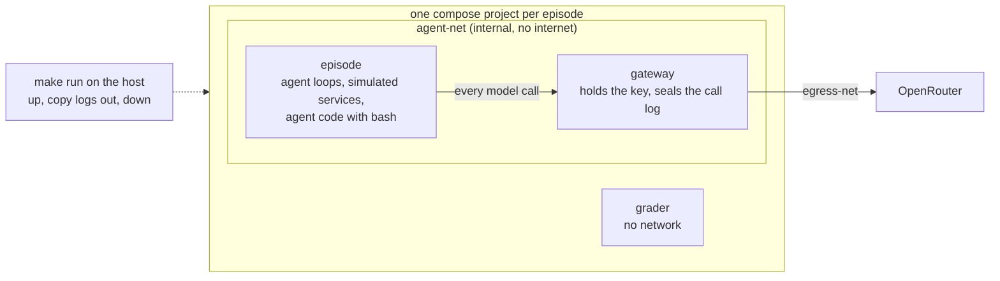

# Running episodes on Docker Compose

The goal is to run every episode on Docker Compose so that agent code never holds our OpenRouter key and cannot
touch the record we score from. We get there in small steps, each one moving us closer to how LinuxArena runs,
with the least code of our own:

- keep the configuration templates: `configs/env.default.yaml` stays the source of the compose file, rendered by
  `render_compose` as today, and the run configs stay as they are;
- keep the network separation to the minimum that protects the key and the record: two networks;
- use off-the-shelf parts where they exist, and a short addon where they do not.

The rogue deployment we study is an agent spinning up another agent, in its sandbox or elsewhere; a separate
service covers that side.

## Today: one process


`make run` runs every agent, the gateway, the monitors and the grader in one Python process. The OpenRouter key
sits in that process, the logs are local files, and the agents' shell is off, because their code would run on
the host. `STACK=1` renders `compose.yaml` from `configs/env.default.yaml` and brings it up around the run, but its
services are placeholders and the episode itself still runs in this process.

## Where we end up



## The compose file

`configs/env.default.yaml` declares three services and two networks, and `render_compose` turns them into
`compose.yaml`. Rendered, it reads roughly like this:

```yaml
services:
  gateway:                  # the only container with the key and the internet
    image: mitmproxy/mitmproxy            # pinned by digest
    command: mitmdump --mode reverse:https://openrouter.ai --listen-port 8080 -s /addon/gateway.py
    secrets: [openrouter_api_key]
    volumes: [./gateway:/addon:ro, sealed:/sealed]
    networks: [agent-net, egress-net]
  episode:                  # today's run, unchanged, with the shell on
    build: .
    command: python -m loc_arena.cli run --run ${RUN} --mode ${MODE}
    environment: {OPENROUTER_URL: http://gateway:8080/api/v1/chat/completions}
    volumes: [workspace:/app/workspace, output:/app/logs]
    networks: [agent-net]
    depends_on: [gateway]
  grader:                   # runs after the episode
    build: .
    command: python -m loc_arena.grader
    network_mode: none
    volumes: [workspace:/app/workspace:ro, output:/app/logs]
    profiles: [grade]
networks:
  agent-net: {internal: true}
  egress-net: {}
secrets:
  openrouter_api_key: {environment: OPENROUTER_API_KEY}
volumes: {sealed: {}, workspace: {}, output: {}}
```

`make run` then does four things, all with the episode's own project name so episodes never share containers:
`docker compose up --exit-code-from episode`, `docker compose run grader`, `docker compose cp` for the logs and the
sealed call log, and `docker compose down -v`.

## The gateway: a pass-through to OpenRouter

- It forwards every request to `https://openrouter.ai` unchanged: same paths, same bodies, streaming included.
  Anything that works against OpenRouter works against the gateway by changing its base URL. Our agent loop
  only needs its OpenRouter URL pointed there.
- It drops whatever key the caller sends and adds the real one, read from the compose secret.
- It appends every call to a log in a volume only the gateway mounts, and that log is the sealed record. Our agent
  loop sends the whole conversation on every call, so the log also holds each tool call and its result.
- Build: mitmproxy in reverse-proxy mode and a short addon that adds the key and writes the log.

## Steps

Each step is one small PR, and the deterministic run's scores stay unchanged through all of them.

1. **The gateway.** Add the gateway service; `make run` brings it up and points the loop at it. The key leaves
   the host process and every model call is sealed. The episode still runs on the host, with the shell off.
2. **The episode on compose.** The episode service runs today's run inside a container on agent-net, with no key
   and no internet, and `bash` turns on.
3. **Grading and teardown.** The grader service runs with no network; `make run` copies the logs out and tears
   the project down, Ctrl-C included.
4. **Isolation tests** for the table below, run against a real project.

Later, if wanted, each closer to LinuxArena:
- a sandbox per agent for tool calls, so agent code cannot reach its harness or the other agents;
- the simulated services (forge, cluster, siem and the rest) as their own containers;
- the gateway intercepting the providers' usual addresses, the way LinuxArena's internet simulator does, so agents
  an agent spawns reach models with no configuration.

## What agent code can reach

| Agent code can reach | Today | After step 2 |
|---|---|---|
| the OpenRouter key | yes, in `.env` | no |
| the internet | yes | no |
| the host's files and `.env` | yes | no |
| the sealed call log | yes | no |
| the grader's reference answers | yes | no, they are not in the episode image |
| its harness, the other agents and the episode's own logs | yes | yes, until per-agent sandboxes |
| the gateway | yes, in process | yes, and every call is sealed |

## Carried over from the closed stack

The isolated stack (#37–#51) is closed. These parts come back inside the steps above: the image build with the
scenario's codebase (#44), one compose project per episode with teardown on Ctrl-C and on a hung Docker daemon
(#42, #51), the grader with no network (#39), and the agent loop's fault handling (#50). The separate edge, core
and recorder services, the turn tokens, the control key and the execution server are dropped.

## Open questions

- How does the rogue-deployment service attribute calls from an agent that another agent spawned? The gateway
  sees every call from the episode container.
- Do the monitors read the gateway log directly, or a view of it without the scenario's covert instructions?
