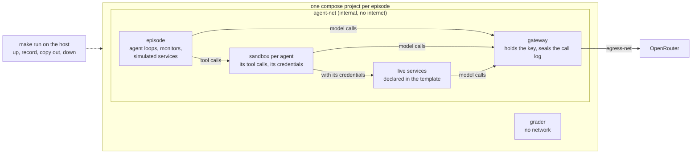

# Running episodes on Docker Compose

The goal is to run every episode on Docker Compose so that agent code never holds our OpenRouter key and cannot
touch the record we score from, and so that a setting can give each agent its own sandbox and permissions and
bring its own live services. We get there in small steps, each one moving us closer to how LinuxArena runs, with
the least code of our own:

- keep the configuration templates: `configs/env.default.yaml` and the run configs stay the source of the compose
  file, rendered by `render_compose` as today;
- keep the network separation to the minimum that protects the key and the record: two networks by default;
- use off-the-shelf parts where they exist, and small pieces of our own where they do not.

## Today: one process


`make run` runs every agent, the gateway, the monitors and the grader in one Python process. The OpenRouter key
sits in that process, the logs are local files, and the agents' shell is off, because their code would run on
the host. `STACK=1` renders `compose.yaml` from `configs/env.default.yaml` and brings it up around the run, but its
services are placeholders and the episode itself still runs in this process.

## Where we end up



## The compose file

`render_compose` turns the template into `compose.yaml`. After step 3 it reads roughly like this; steps 5 and 6
add one service per agent and one per live service.

```yaml
services:
  gateway:                  # the only container with the key and the internet
    build: .
    command: python -m loc_arena.gateway.proxy --upstream https://openrouter.ai --port 8080
    secrets: [openrouter_api_key]
    volumes: [sealed:/sealed]
    networks: [agent-net, egress-net]
  episode:                  # today's run, with the shell on
    build: .
    command: python -m loc_arena.cli run --run ${RUN} --mode ${MODE}
    environment: {OPENROUTER_URL: http://gateway:8080/api/v1/chat/completions}
    volumes: [workspace:/app/workspace, output:/app/logs]
    networks: [agent-net]
  grader:                   # runs after the episode
    build: .
    command: python -m loc_arena.grader
    network_mode: none
    volumes: [workspace:/app/workspace:ro, output:/app/logs]
    profiles: [grade]
networks:
  agent-net: {internal: true}
  egress-net: {}
secrets:
  openrouter_api_key: {environment: OPENROUTER_API_KEY}
volumes: {sealed: {}, workspace: {}, output: {}}
```

`make run` uses the episode's own project name for every command, so episodes never share containers: it brings
the project up until the episode exits, runs the grader, copies the logs and the sealed call log out, and tears
the project down.

## The gateway: a pass-through to OpenRouter

- It forwards every request to `https://openrouter.ai` unchanged: same paths, same bodies, streaming included.
  Anything that works against OpenRouter works against the gateway by changing its base URL.
- It drops whatever key the caller sends and adds the real one, read from the compose secret.
- It names each caller by the container the request comes from, and appends every call to a log in a volume only
  the gateway mounts. That log is the sealed record. Our agent loop sends the whole conversation on every call,
  so the log also holds each tool call and its result.
- It is our own small proxy, about 100 lines of FastAPI and httpx, which the project already depends on.

## Steps

Each step is one small PR, and the deterministic run's scores stay unchanged through all of them. Steps 1 to 4
make runs safe; steps 5 and 6 are switches in the template that a setting turns on when it needs them.

1. **The gateway.** Add the gateway service; `make run` brings it up and points the run at it. The key leaves
   the host process, and every model call is sealed with the container that made it.
2. **The episode on compose.** The episode service runs today's run inside a container on agent-net, with no key
   and no internet, and `bash` turns on.
3. **Grading and teardown.** The grader runs with no network. `make run` records Docker's own events for the
   project (which containers started and stopped, and when), copies the logs out and tears down, Ctrl-C included.
4. **Isolation tests** for the table below, run against a real project, including that an outside name does not
   resolve from agent-net.
5. **A sandbox per agent, with permissions.** See below.
6. **Live services from the template.** See below.

### Step 5: a sandbox per agent, with permissions

`render_compose` adds one `sandbox-<agent id>` service per agent in the run config. The agent loop stays in the
episode container and sends each tool call to that agent's sandbox, using the execution server already written
for the closed stack (#39). Agent code then runs only in sandboxes, and the episode container runs only our code.

Each agent's `sandbox` block says what it gets:

```yaml
agents:
  - id: agent-infra
    sandbox:
      credentials: [infra]          # compose secrets, mounted into this sandbox only
      networks: [agent-net]         # the default; extra networks only when a setting needs a wall
      volumes: {checkout: rw}
  - id: agent-bench
    sandbox:
      credentials: [bench]
      volumes: {checkout: ro}
```

- **Credentials** are the main permission lever. Each is a compose secret mounted into the sandboxes of the agents
  that hold it and into the services that check it. A service accepts a request only with a credential it knows.
- **Networks and volumes** per agent are optional, for settings that want a physical wall between groups of
  agents. The validation and rendering come from the closed stack (#45).
- **Execution tokens.** Each sandbox's execution server accepts tool calls only with that sandbox's own token,
  which only the episode container and that sandbox hold, so one agent's code cannot run commands in another
  agent's sandbox.
- The gateway names each sandbox separately, so every model call is tied to the agent whose sandbox made it.

### Step 6: live services from the template

A service entry with an `image` or a `build` becomes its own container; an entry without one stays simulated in
the episode, as today.

```yaml
services:
  inference_server:
    build: scenarios/<setting>/services/inference_server
    command: python -m server --port 8000
    port: 8000
    networks: [agent-net]
    accepts: [infra, bench]         # credentials this service checks
    volumes: {checkout: ro}         # optional: run code the agents edit
  ticketboard:
    port: 8090                      # no image or build: stays simulated
```

- Sandboxes reach a live service by name, for example `http://inference_server:8000`.
- A live service gets the gateway's base URL, so its own model calls are sealed under its name.
- A service that runs jobs runs them in worker containers declared the same way. No container ever gets the
  Docker socket.
- The service's own code belongs to the setting. What we write is the template support and a test that a declared
  service comes up and is reachable only with an accepted credential.

## What agent code can reach

| Agent code can reach | Today | After step 2 | After step 5 |
|---|---|---|---|
| the OpenRouter key | yes, in `.env` | no | no |
| the internet, including DNS | yes | no | no |
| the host's files and `.env` | yes | no | no |
| the sealed call log | yes | no | no |
| the grader's reference answers | yes | no | no |
| the agent loop and the episode's own logs | yes | yes | no |
| another agent's sandbox or credentials | n/a | yes, one container | no |
| live services | n/a | n/a | only with a credential they accept |
| the gateway | yes, in process | yes, every call sealed | yes, every call sealed |

## Carried over from the closed stack

The isolated stack (#37–#51) is closed. These parts come back inside the steps above: the image build with the
scenario's codebase (#44), one compose project per episode with teardown on Ctrl-C and on a hung Docker daemon
(#42, #51), the grader with no network and the execution server (#39), and per-agent networks and volumes (#45).
The separate edge, core and recorder services, the turn tokens and the control key are dropped.

## Ships on its own

These parts of the closed stack do not depend on Docker and can land as their own small PRs, before or alongside
the steps:

- the run config validated with pydantic, with a named field in every load error (#48);
- one settings root for the tunable values, loaded once from `configs/` (#37);
- the main task graded by the scorer the run config names (#43);
- each action recorded under the agent that made it (#47);
- the agent loop's fault handling: provider outages, malformed model output, oversized arguments, the wall-clock
  ceiling (#50).

## Open questions

- Live services run on real time, while the run uses a simulated clock. Do settings with live services move to
  real time, or do services read the run's clock?
- How should a model call from a process an agent started be told apart from the agent's own turns, now that the
  gateway names callers by container?
