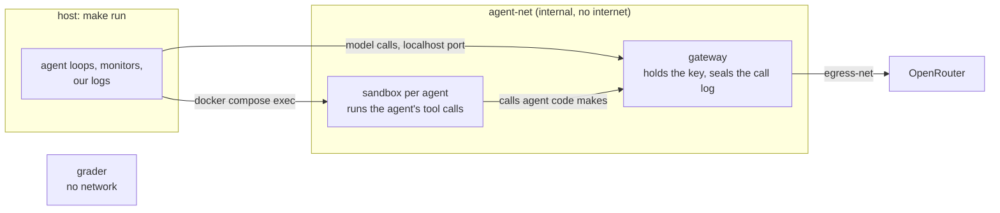

# Running episodes in Docker

The goal is to run each episode with Docker so that agent code never holds our OpenRouter key and cannot touch
the records we score from. We get there in small steps, each one moving us closer to how LinuxArena runs, with
the least code of our own:

- keep the run config templates in `configs/` as they are;
- keep the network separation to the minimum that protects the key and the records: two networks;
- use off-the-shelf parts where they exist, and a short addon where they do not.

The rogue deployment we study is an agent spinning up another agent, in its sandbox or elsewhere; Halil's
service covers that side.

## Today: one process

`make run` runs every agent, the gateway, the monitors and the grader in one Python process. The OpenRouter key
sits in that process, the logs are local files, and the agents' shell is off, because their code would run on
the host. `STACK=1` brings an optional Docker stack up around the run, but the episode itself still runs in this
process.

## Where we end up

This is LinuxArena's default shape. The agent loop runs on the host and drives each sandbox with
`docker compose exec`, the way Inspect's Docker sandbox does, so the loop shares no network with agent code. The
gateway plays the part of LinuxArena's internet simulator: the only way out, holding the key.

| Container | Runs | Networks | Holds |
|---|---|---|---|
| sandbox (one per agent) | the tool calls of one agent, `bash` included | agent-net | its workspace |
| gateway | mitmproxy and our addon | agent-net, egress-net | the OpenRouter key, the sealed call log |
| grader | the scenario's measure step | none | the checkout, read-only |

## The gateway: a pass-through to OpenRouter

- It forwards every request to `https://openrouter.ai` unchanged: same paths, same bodies, streaming included.
  Anything that works against OpenRouter works against the gateway by changing its base URL. Our agent loop
  only needs its OpenRouter URL pointed there.
- It drops whatever key the caller sends and adds the real one. The key reaches the gateway as a compose secret
  and lives nowhere else.
- It names each caller by where the request comes from (the host loop, or a sandbox) and appends every call to a
  log in a volume only the gateway mounts. The host copies the log out after the episode. Our agent loop sends
  the whole conversation on every call, so this log also holds each tool call and its result.
- Build: mitmproxy in reverse-proxy mode (`--mode reverse:https://openrouter.ai`) and a short addon that adds the
  key, names the caller and writes the log.

## Steps

Each step is one small PR, and the deterministic run's scores stay unchanged through all of them.

1. **The gateway.** `make run` starts the gateway container and points the loop at it. The key leaves the host
   process, and every model call is sealed in the gateway's log. Agents still run on the host, with the shell
   off.
2. **Sandboxes.** Each agent's tool calls run in its own container through `docker compose exec`, and `bash`
   turns on. The compose file is rendered from the run config templates, one sandbox per agent. This is the
   step that makes agent code safe to run.
3. **Grading and teardown.** The grader runs with no network; `make run` copies the logs out and tears the
   project down, Ctrl-C included.
4. **Isolation tests** for the table below, run against a real stack.

Later, if wanted: the gateway intercepts the providers' usual addresses (`openrouter.ai`, `api.openai.com`,
`api.anthropic.com`) the way LinuxArena's internet simulator does, so agents an agent spawns reach models with
no configuration. And a harness can move inside the sandbox, as LinuxArena does for CLI agents.

## What agent code can reach

| Agent code can reach | Today | After step 2 |
|---|---|---|
| the OpenRouter key | yes, in `.env` | no |
| the internet | yes | no |
| the host's files, `.env` and our logs | yes | no |
| the sealed call log | yes | no |
| the grader's reference answers | yes | no |
| other agents' sandboxes | n/a | yes, over agent-net |
| the gateway | yes, in process | yes, and every call is logged |

## Carried over from the closed stack

The isolated stack (#37–#51) is closed. These parts come back inside the steps above: one compose project per
episode with teardown on Ctrl-C and on a hung Docker daemon (#42, #51), the grader with no network (#39), and
the fault handling found by stress testing (#50). The separate edge, core and recorder services, the turn tokens,
the control key and the execution server are dropped: `docker compose exec` and one gateway cover what they did.

## Open questions

- How does Halil's service attribute calls from an agent that another agent spawned inside the same sandbox? The
  gateway sees both under that sandbox.
- Do the monitors read the gateway log directly, or a view of it without the scenario's covert instructions?
