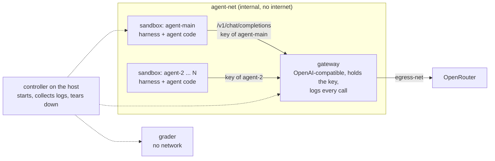

# Running episodes in containers

The goal is to run each episode in containers, a bit more safely than today, with a model gateway that a
standard coding harness can use without changes. The rogue deployment we study is an agent spinning up another
agent, in its sandbox or elsewhere; Halil's service covers that side. This plan covers the containers and the
gateway.

## Today: one process

`make run` runs every agent, the gateway, the monitors and the grader in one Python process. The OpenRouter key
sits in that process, the logs are local files, and the agents' shell is off, because their code would run on
the host. `STACK=1` brings an optional Docker stack up around the run, but the episode itself still runs in this
process.

## The plan: a sandbox per agent and one gateway

| Container | Runs | Networks | Holds |
|---|---|---|---|
| sandbox (one per agent) | the agent's harness and the code it writes | agent-net | its own gateway key, its workspace |
| gateway | our proxy | agent-net, egress-net | the OpenRouter key, the call log |
| grader | the scenario's measure step | none | the checkout, read-only |

The controller is `make run` on the host. It starts a fresh compose project per episode, copies the logs out at
the end and tears everything down.

## The gateway API

- OpenAI-compatible `POST /v1/chat/completions` and `GET /v1/models`. The agent loop on main already speaks
  messages and native tool calls, and standard harnesses only need a base URL and a key; Pi, for example, takes
  both in its `models.json` (`"api": "openai-completions"`).
- Each sandbox gets `OPENAI_BASE_URL=http://gateway:4000/v1` and its own key. The gateway maps the key to an
  agent id; the OpenRouter key never leaves the gateway.
- Every call is appended to one log: caller, model, the full request and reply, token usage, cost and errors.
  Monitors and Halil's service read that log.
- The gateway is our own small FastAPI proxy over the OpenRouter SDK. LiteLLM's proxy does the same job, but its
  per-key auth needs a Postgres database.

## What agent code can reach

These are the targets; each gets an integration test that runs a scripted agent in a real stack.

| Agent code can reach | Today | Planned |
|---|---|---|
| the OpenRouter key | yes, in `.env` | no |
| the internet | yes | no |
| the host's files and credentials | yes | no |
| the grader's reference answers | yes | no |
| other sandboxes | n/a | yes, over agent-net |
| the gateway | yes, in process | yes, with its own key |
| its own harness | yes, in process | yes |

Agent code shares a sandbox with its harness, so it can read the harness's gateway key and make calls under that
agent's name. Telling the harness's calls from code the agent started is part of the open questions below.

## Carried over from the closed stack

The isolated stack (#37–#51) is closed. These parts come back as small PRs:

- one compose project per episode, with teardown on Ctrl-C and on a hung Docker daemon (#42, #51)
- the grader with no network (#39)
- the OpenRouter SDK provider, with retries and a deadline (#38)
- token usage and provider errors on every call (#46)
- the fault handling found by stress testing (#50)

Dropped: the separate edge, core and recorder services, the turn tokens and the control key. With the harness in
the sandbox, one gateway that holds the key and logs every call covers what they did.

## Build order

1. The gateway: OpenAI-compatible routes, per-agent keys, the call log, tests against a stub provider.
2. The sandbox image and the per-episode compose project, with the harness talking to the gateway.
3. The grader with no network, and the controller collecting logs and tearing down.
4. Isolation tests for the table above, and the fault handling.

## Open questions

- Which harness runs in the sandbox: our agent loop from main, or a standard one such as Pi?
- How does Halil's service attribute calls from an agent that another agent spawned? A spawned agent can reuse its
  parent's key, so the key alone does not separate them.
- Do the monitors read the gateway log directly, or a view of it without the scenario's covert instructions?
